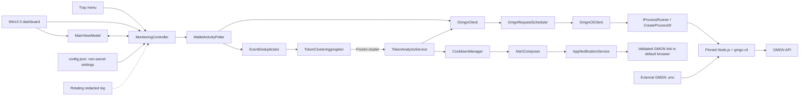
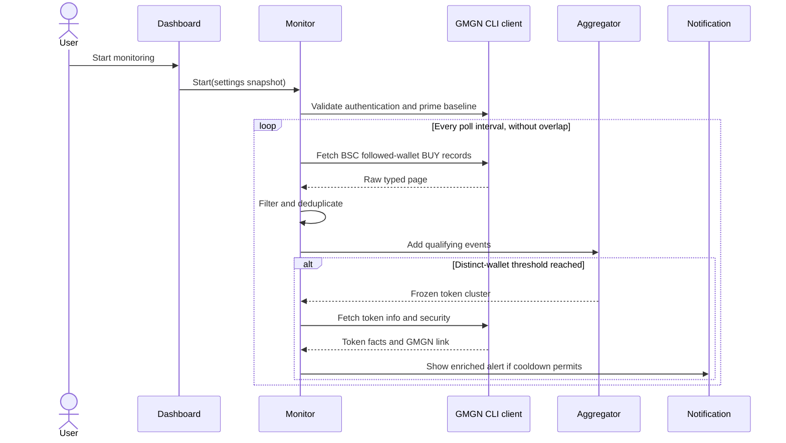

# GMemMonitor MVP Architecture

## Purpose

GMemMonitor is a native, read-only Windows 11 x64 desktop application. It polls GMGN for BSC BUY activity from wallets currently followed by the authenticated account, detects coordinated token purchases, enriches qualifying clusters with GMGN facts, and sends a Windows notification that links to GMGN for manual review.

The MVP deliberately has no trading, blockchain RPC, database, backend service, embedded browser, scoring engine, or local HTTP API.

## Component view



## Runtime data flow

1. The user starts monitoring from the dashboard or tray.
2. The controller validates an immutable snapshot of settings and verifies that the bundled CLI can authenticate using the user's external GMGN configuration.
3. The poller establishes a startup baseline using:

   ```text
   gmgn-cli track follow-wallet --chain bsc --side buy --limit 100 --raw
   ```

   Existing record IDs are cached but pre-session trades are not aggregated.
4. One non-overlapping poll runs every configured interval. Transient failures back off; authentication failures stop the session.
5. New records are parsed, normalized, deduplicated, filtered by session time and minimum USD amount, and added to per-token rolling clusters.
6. A token cluster freezes when it contains qualifying BUY events from the configured number of distinct wallets. The triggering event belongs only to that frozen cluster; a new empty cluster begins immediately.
7. The analysis service retrieves required token-info and token-security facts through the same globally rate-scheduled GMGN client.
8. Every successfully enriched qualifying cluster produces an alert model unless the token is in cooldown.
9. A Windows notification displays factual information and may open only a validated GMGN HTTPS URL.

### Rate-limit boundary

GMGN controls server-side request and IP limits. GMemMonitor must never attempt to
bypass them. When the pinned CLI reports HTTP 429/`RATE_LIMIT_EXCEEDED`, the transport
classifies it as `RateLimited` without exposing raw stderr. The implemented
`GmgnCliClient` records a local cooldown from the CLI's reported remaining duration
(with a small safety margin) and suppresses further requests from that client. If no
duration is available, it uses a conservative 60-second cooldown. The planned global
`GmgnRequestScheduler` remains responsible for coordinating feed and enrichment work;
the current dashboard does not yet start that controller.



## Component responsibilities

| Component | Responsibility |
|---|---|
| `MainWindow` / `MainViewModel` | Render state and settings; dispatch user commands; never parse GMGN data. |
| `MonitoringController` | Own the monitoring state machine, settings snapshot, workers, cancellation, and UI-safe status events. |
| `WalletActivityPoller` | Schedule one feed request at a time, establish baseline, and classify retry/authentication failures. |
| `GmgnCliClient` | Map typed operations to a fixed executable and argument vector; parse structured output. |
| `ProcessRunner` | Launch the pinned executable without a shell, capture bounded output, enforce timeout/cancellation, and kill the Job Object on shutdown. |
| `GmgnRequestScheduler` | Apply conservative global weighted admission and rate-limit reset/backoff behavior. |
| `EventDeduplicator` | Maintain a bounded session-only cache keyed by valid GMGN ID or a canonical SHA-256 fallback. |
| `TokenClusterAggregator` | Maintain exact rolling token/wallet event windows and freeze qualifying clusters. |
| `TokenAnalysisService` | Fetch the required token-info and token-security records and normalize factual risk data. |
| `CooldownManager` | Suppress repeat notifications for the same normalized BSC token using `steady_clock`. |
| `AppNotificationService` | Display native notifications and handle activation. |
| `TrayIconService` | Add/recreate/remove the taskbar icon and expose Open, Start/Stop, and Exit commands. |
| `ConfigurationService` | Persist validated non-secret settings atomically under `%LOCALAPPDATA%`. |
| `LoggingService` | Write small rotating redacted diagnostic logs. |

## Core interfaces

The names are contracts for implementation; concrete asynchronous result types may use the smallest C++/WinRT-compatible mechanism selected during Phase 02.

```cpp
struct IProcessRunner {
    virtual ~IProcessRunner() = default;
    virtual ProcessResult Run(
        const ProcessRequest& request,
        std::stop_token stop) = 0;
};

struct IGmgnClient {
    virtual ~IGmgnClient() = default;
    virtual FollowWalletPage FetchFollowWalletBuys(std::stop_token stop) = 0;
    virtual TokenInfo FetchTokenInfo(const EvmAddress& token,
                                     std::stop_token stop) = 0;
    virtual TokenSecurity FetchTokenSecurity(const EvmAddress& token,
                                             std::stop_token stop) = 0;
};

struct IClock {
    virtual ~IClock() = default;
    virtual std::chrono::system_clock::time_point UtcNow() const = 0;
    virtual std::chrono::steady_clock::time_point SteadyNow() const = 0;
};

struct INotificationService {
    virtual ~INotificationService() = default;
    virtual void Show(const TokenAlert& alert) = 0;
};
```

There is no `FetchFollowedWallets` contract because the approved MVP intentionally uses GMGN's dynamic server-side follow set. There is no scoring interface in V1.

## Core data contracts

```cpp
enum class Chain { Bsc };
enum class TradeSide { Buy };

struct EvmAddress {
    std::array<std::byte, 20> bytes;
};

struct MoneyUsd {
    std::int64_t micros;
};

struct WalletBuyEvent {
    std::string gmgnRecordId;
    std::string transactionHash;
    EvmAddress wallet;
    EvmAddress token;
    std::string sanitizedSymbol;
    MoneyUsd amountUsd;
    std::string baseAmount;
    std::string priceUsd;
    std::chrono::system_clock::time_point timestamp;
};

struct WalletContribution {
    EvmAddress wallet;
    WalletBuyEvent largestUnexpiredBuy;
};

struct FrozenTokenCluster {
    EvmAddress token;
    std::vector<WalletContribution> wallets;
    std::chrono::system_clock::time_point triggeredAt;
};

struct TokenAnalysis {
    EvmAddress token;
    std::string sanitizedSymbol;
    TokenInfo info;
    TokenSecurity security;
    std::string validatedGmgnUrl;
};

struct TokenAlert {
    EvmAddress token;
    std::string sanitizedSymbol;
    std::size_t qualifyingWallets;
    MoneyUsd largestQualifyingBuy;
    std::vector<RiskFact> riskFacts;
    std::string validatedGmgnUrl;
};
```

`MoneyUsd` uses micro-USD so `$99.99` and `$100.00` comparisons are exact. Preserve arbitrary token quantities and prices as validated decimal strings unless arithmetic is explicitly required.

## Aggregation invariants

Runtime storage is logically:

```text
token address
  -> wallet address
       -> deque of qualifying, unexpired BUY events
```

- An event is expired only when `event.timestamp < now - window`; equality remains inside the window.
- A wallet counts once, represented by its largest currently unexpired BUY.
- Repeated purchases must remain in the deque so an older maximum can expire without losing a later smaller purchase.
- At the distinct-wallet threshold, copy exact representatives into an immutable frozen cluster, replace the active token cluster with an empty one, then enqueue analysis.
- The triggering event is not reused in the new cluster.

## State and threading

```text
Stopped -> Authenticating -> Monitoring
                         \-> AuthenticationRequired
Monitoring <-> Retrying
Monitoring -> Stopped on user stop, shutdown, or suspend
```

- UI thread: XAML, view-model updates, tray commands, notification activation.
- Monitoring `std::jthread`: state transitions and non-overlapping polling.
- Bounded analysis executor: independent token analyses admitted through the GMGN scheduler.
- Process runner: pipe reads and owned child-process lifetime.
- Settings are editable only in `Stopped` and are snapshotted on Start.
- Monitoring always starts OFF and remains OFF after resume from sleep.

## Storage layout

```text
%LOCALAPPDATA%\GMemMonitor\config.json
%LOCALAPPDATA%\GMemMonitor\logs\gmemmonitor.log
%USERPROFILE%\.config\gmgn\.env
```

Only the first two paths are owned by GMemMonitor. The external GMGN file is owned by the user/CLI and must never be copied, rewritten, or logged by the application.

Runtime-only state includes the baseline/dedupe cache, active/frozen clusters, analyses, cooldowns, last poll, and last analyzed token.

## Security boundaries

- Invoke only the bundled executable at a resolved path inside the application directory; never search `PATH` or use `npx` at runtime.
- Pass arguments as a correctly quoted argument vector and never through `cmd.exe` or PowerShell.
- Bound stdout/stderr size, execution time, pending analyses, cached IDs, and log retention.
- Accept forward-compatible extra JSON fields, but fail the affected record when a correctness-critical field is missing or invalid.
- Strip control characters and cap symbol/name lengths before display.
- Browser links must parse successfully, use HTTPS, contain no userinfo, and match an approved GMGN hostname.
- GMGN security fields are indicators, not guarantees; notifications must not say a token is safe.

## Deployment shape

```text
GMemMonitor\
  GMemMonitor.exe
  runtime\node.exe
  runtime\gmgn-cli\...
  Windows App SDK self-contained files
  required native DLLs and resources
  THIRD_PARTY_NOTICES.txt
```

The executable is an unpackaged WinUI 3 application built with MSBuild. The portable ZIP is x64-only for the MVP and has no automatic updater.
