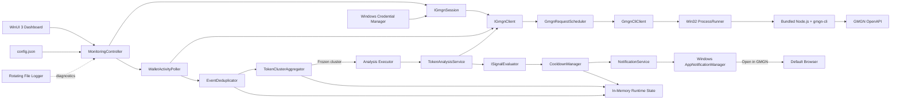
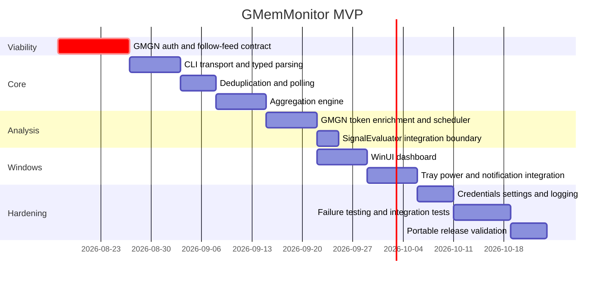

# GMemMonitor — Deep Research, Technical Architecture, and Development Plan

This report defines an implementation-ready architecture for **GMemMonitor**, a native Windows 11 application that monitors coordinated BNB Smart Chain purchases by wallets followed in the user's GMGN account, enriches triggered tokens exclusively with GMGN data, evaluates them through a future 0–100 signal scorer, and sends native Windows notifications. It follows the hard constraints and aggregation semantics in the supplied project specifications. fileciteturn0file0 fileciteturn0file1

Research status is current to **August 14, 2026**. Throughout the report:

| Label | Meaning |
|---|---|
| **CONFIRMED** | Explicitly documented by GMGN/Microsoft primary sources. |
| **INFERRED** | Strongly implied by documented behavior, but not contractually explicit. |
| **UNKNOWN** | Public official documentation reviewed does not establish the behavior. |
| **UNSUPPORTED** | The requested concept is explicitly inapplicable or no supported interface was found for it. |

## Executive recommendation and feasibility

### Executive recommendation

**Use `gmgn-cli --raw` as the GMemMonitor V1 integration layer. Do not implement GMGN HTTP calls directly yet.**

GMGN's official OpenAPI repository documents the underlying route names, fields, authentication model, and rate-limit weights, but its own integration instructions explicitly direct clients toward `gmgn-cli`. The public material reviewed does not provide enough of the complete HTTP signing protocol—base URL, canonical signing input, timestamp/nonce semantics, and all failure contracts—to justify independently implementing signed OpenAPI requests in C++ without relying on undocumented behavior. GMGN explicitly positions the CLI as the supported structured-data interface and supports local development through `node dist/index.js ...` as well as the globally installed CLI. citeturn19search0turn24search0

For the critical account-specific feature, GMGN **CONFIRMS**:

> `track follow-wallet` returns trades from wallets that the authenticated user personally follows, and that follow list is resolved from the GMGN account bound to the API key.

The command supports BSC, `--side buy`, a 1–100 result limit, USD filters, and raw JSON. citeturn19search0turn19search2

However, there is a **blocking mismatch between the strict GMemMonitor specification and the currently documented GMGN interface**:

**I found no documented official CLI/OpenAPI operation that enumerates the complete list of wallet addresses followed by the authenticated account.**

GMGN exposes the **trade feed generated from those followed wallets**, but the official `gmgn-track` command set contains `follow-wallet`, `follow-tokens`, and `follow-token-groups`; `follow-tokens` means tokens bookmarked by a wallet, not wallet accounts followed by the current user. citeturn19search0

That creates three consequences:

| Requirement | Current status | Consequence |
|---|---|---|
| Automatically use GMGN-followed wallets | **CONFIRMED** through `track follow-wallet` | Feasible. |
| Fetch the complete followed-wallet list at Start | **UNKNOWN / NOT DOCUMENTED** | Strict startup flow cannot yet be implemented. |
| Display exact followed-wallet count | **UNKNOWN / NOT DOCUMENTED** | Cannot infer count from active trades. |
| Freeze that list for the whole monitoring session | **NOT IMPLEMENTABLE from the documented feed alone** | `follow-wallet` resolves account follows server-side; subsequent account changes may affect later polls. |
| Monitor BSC BUY activity | **CONFIRMED** | Feasible. |
| Obtain GMGN token/security/intelligence data | **CONFIRMED** | Very strong coverage. |
| Poll around every 20 seconds | **Feasible** | Single polling call is far below documented rate capacity. |
| Lossless pagination | **UNKNOWN** | The response documents `next_page_token`, but the documented CLI options do not expose a corresponding cursor/page-token option for `follow-wallet`. |
| Current GMGN page viewers | **NOT DOCUMENTED** | Do not invent this metric. |
| Hot/search popularity | **CONFIRMED** | `visiting_count`, hot-search rank, trending rank, `hot_level`. |
| Direct HTTP from C++ | **Underlying routes confirmed; implementation contract incomplete** | Do not use for V1. |
| Exact GMGN token browser URL | **CONFIRMED as response field** | Use `link.gmgn`; never hardcode a URL template. |

The project's **first development milestone must therefore be an API-viability spike, not WinUI development**. No substantial application work should begin until followed-wallet snapshot behavior and follow-wallet pagination are resolved experimentally or clarified by GMGN.

### Recommended interpretation of the MVP

There are two legitimate product paths.

**Strict GMemMonitor** preserves the user's original requirements exactly. Development stops at the viability gate until GMGN provides or confirms a supported way to enumerate and freeze followed wallets and safely page the activity feed.

**Pragmatic GMemMonitor MVP** relaxes only one semantic rule: instead of freezing a locally retrieved followed-wallet snapshot, every poll asks GMGN for the activity of whatever follows are currently associated with the authenticated account. Everything else—BUY-only behavior, deduplication, aggregation, token analysis, rate limiting, cooldown, notifications—remains exactly as specified.

I recommend **not silently making that relaxation**. It changes signal semantics and makes the displayed followed-wallet count unavailable.

### Product purpose and scope

Despite the name **GMemMonitor**, V1 should **not classify or filter tokens as memecoins**. The later detailed specification explicitly requires analysis of every token that meets the wallet-cluster trigger, including stablecoins, WBNB, BTCB, ETH, wrapped assets, and established tokens. The project's purpose is therefore better defined as:

> **A GMGN-followed-wallet convergence monitor optimized for finding BSC token/memecoin momentum signals.**

This keeps the strategy memecoin-oriented without creating an unreliable token taxonomy.

The target user is an active GMGN/BSC researcher or trader who already curates wallets in GMGN and wants passive signal detection without running a blockchain node, maintaining a separate wallet list, or granting a desktop application any blockchain signing authority.

Primary use cases are:

1. Detect several followed wallets buying the same BSC token within a short interval.
2. Reject individual purchases below the configured USD requirement.
3. Automatically enrich only tokens that cross the wallet-convergence threshold.
4. Use GMGN's momentum, security, holder, Smart Money, KOL, insider and bundler intelligence.
5. Deliver a compact Windows signal and hand the user directly to GMGN for manual investigation/trading.

Automatic trading, SELL-driven signals, historical analytics, portfolio management, wallet grouping, local token discovery, blockchain RPC access, custom memecoin classification, and local signal-history databases are deliberately outside V1. fileciteturn0file0

## GMGN capability and data contract

### BSC and followed-wallet monitoring

GMGN's current official OpenAPI/skills repository lists BSC among the supported chains for token, market, portfolio and tracking operations. It describes followed-wallet monitoring as real-time GMGN data, although **GMemMonitor itself remains a polling client and must not be described as real-time in the sub-second sense**. citeturn24search0turn19search0

The core V1 command contract is:

```text
gmgn-cli track follow-wallet \
    --chain bsc \
    --side buy \
    --limit 100 \
    --raw
```

Documented options include:

```text
--chain bsc
--wallet <optional followed wallet>
--limit 1..100
--side buy|sell
--filter ...
--min-amount-usd ...
--max-amount-usd ...
--raw
```

The follow list is resolved automatically from the account bound to the API key when `--wallet` is omitted. citeturn19search0turn19search2

**Important:** although `--min-amount-usd` exists, I recommend applying GMemMonitor's `$100` threshold locally until a live contract test proves that GMGN's server-side boundary semantics are exactly inclusive. The required GMemMonitor rule is `$99.99 → reject`, `$100 → accept`; relying prematurely on a remote filter could cause an irreversible missed event. The remote filter can later be enabled as a traffic optimization after that boundary is verified.

### Exact BUY-event contract

The documented follow-wallet response is:

```json
{
  "next_page_token": "<opaque>",
  "list": [
    {
      "id": "<base64-record-id>",
      "chain": "bsc",
      "transaction_hash": "<transaction-hash>",
      "maker": "<followed-wallet>",
      "side": "buy",
      "base_address": "<token-contract>",
      "quote_address": "<quote-token>",
      "base_amount": "<token-amount>",
      "quote_amount": "<quote-amount>",
      "amount_usd": "<usd-value>",
      "cost_usd": "<usd-value>",
      "buy_cost_usd": "<usd-value>",
      "price": "<quote-price>",
      "price_usd": "<usd-price>",
      "price_now": "<current-usd-price>",
      "price_change": "<ratio>",
      "timestamp": 0,
      "is_open_or_close": 0,
      "base_token": {
        "symbol": "<symbol>",
        "hot_level": 0,
        "total_supply": "<supply>",
        "token_create_time": 0,
        "token_open_time": 0
      },
      "maker_info": {
        "address": "<wallet>",
        "name": "<display-name>",
        "tags": [],
        "tag_rank": {}
      },
      "balance_info": null
    }
  ]
}
```

The structure above uses placeholders, not fabricated example data. All shown field names come from the official GMGN schema. GMGN documents `id` as the base64-encoded record ID and says to use it as a cursor; `maker` is the followed wallet, `base_address` is the traded token, `amount_usd` is the USD transaction value, `base_amount` is the token quantity in its smallest unit, and `side` is `buy` or `sell`. citeturn19search0

| Required GMemMonitor field | Exact GMGN field | Meaning / unit | Type contract | BSC | Status |
|---|---|---|---|---|---|
| Unique activity ID | `id` | GMGN record ID, base64-encoded | String | Yes | **CONFIRMED** |
| Transaction hash | `transaction_hash` | BSC transaction hash | String | Yes | **CONFIRMED** |
| Log/event index | — | Event index within transaction | — | — | **NOT DOCUMENTED** |
| Wallet | `maker` | Followed wallet address | String | Yes | **CONFIRMED** |
| Action | `side` | `buy` / `sell` | String enum | Yes | **CONFIRMED** |
| Token | `base_address` | Token contract | String | Yes | **CONFIRMED** |
| Symbol | `base_token.symbol` | Token ticker | String | Yes | **CONFIRMED** |
| Timestamp | `timestamp` | Unix timestamp | Numeric scalar | Yes | **CONFIRMED** |
| USD size | `amount_usd` | USD transaction value | Exact JSON numeric representation not guaranteed in prose schema | Yes | **CONFIRMED field; type detail UNKNOWN** |
| Cost | `cost_usd` | Same transaction-leg USD value | Same caveat | Yes | **CONFIRMED** |
| Token quantity | `base_amount` | Smallest-unit token quantity | Numeric/string representation not guaranteed | Yes | **CONFIRMED** |
| Quote quantity | `quote_amount` | Quote amount spent/received | Representation not guaranteed | Yes | **CONFIRMED** |
| Execution price | `price_usd` | USD token price at transaction time | Numeric scalar | Yes | **CONFIRMED** |
| Current price | `price_now` | Current USD token price | Numeric scalar | Yes | **CONFIRMED** |
| Full/partial position | `is_open_or_close` | Follow-wallet: 1 full open/close; 0 partial add/reduce | Integer enum | Yes | **CONFIRMED** |

GMGN provides the `side` classification, so GMemMonitor does **not** need to decode PancakeSwap transaction paths itself. However, GMGN does not document the underlying algorithm, DEX coverage methodology, or error rate by which a raw transaction becomes `side="buy"`. Therefore the field exists and should be trusted as the source contract, while its classification reliability is **UNKNOWN**. citeturn19search0

### Deduplication identifier

There is no documented BSC log index in the follow-wallet record. Therefore:

**Primary key:**

```text
gmgn_event_key = id
```

The official documentation calls `id` the record ID and says it can be used as a cursor. That makes its stability/uniqueness a strong **INFERENCE**, although GMGN does not separately state a formal global-uniqueness guarantee. citeturn19search0

Fallback when `id` is missing or malformed:

```text
SHA-256(
    chain || '\0' ||
    transaction_hash || '\0' ||
    maker || '\0' ||
    base_address || '\0' ||
    side || '\0' ||
    timestamp || '\0' ||
    base_amount || '\0' ||
    amount_usd
)
```

Do **not** use transaction hash alone. One BSC transaction can conceptually contain multiple activity legs, and GMGN does not promise a one-record-per-transaction invariant.

### Follow-wallet pagination problem

GMGN's response contains:

```text
next_page_token
```

and describes:

```text
id = record ID, use as cursor
```

but the documented `track follow-wallet` command options currently do **not** include `--cursor` or `--page-token`. By contrast, `track follow-tokens` explicitly documents a `--cursor` argument. citeturn19search0

Therefore these remain **UNKNOWN**:

- whether `next_page_token` can currently be supplied through an undocumented CLI parameter;
- whether subsequent polling automatically advances a server cursor;
- whether every invocation simply returns the most recent N records;
- ordering guarantees;
- exact historical lookback;
- whether more than 100 followed-wallet trades between polls can cause missed events.

This is the second major Phase-A acceptance gate.

### Token-information coverage

GMGN's token API coverage is exceptionally suitable for GMemMonitor. BSC is supported for token info, security, pool, holders and traders. Current documented route weights are:

| CLI operation | Documented underlying route | Weight |
|---|---|---:|
| `token info` | `GET /v1/token/info` | 1 |
| `token security` | `GET /v1/token/security` | 1 |
| `token pool` | `GET /v1/token/pool_info` | 1 |
| `token holders` | `GET /v1/market/token_top_holders` | 5 |
| `token traders` | `GET /v1/market/token_top_traders` | 5 |

GMGN currently documents a leaky-bucket limiter of `rate=20`, `capacity=20` for these routes. citeturn22view0

The most useful token fields for GMemMonitor are:

| Category | Exact GMGN field | Meaning / unit | Nullable/type observations | BSC | Status |
|---|---|---|---|---|---|
| Identity | `address` | Token contract | String | Yes | **CONFIRMED** |
| | `symbol`, `name` | Token metadata | String; attacker-controlled metadata | Yes | **CONFIRMED** |
| | `decimals` | Token decimals | Integer-like | Yes | **CONFIRMED** |
| Supply | `total_supply` | Total supply | Scalar/string representation | Yes | **CONFIRMED** |
| | `circulating_supply` | Circulating supply | Scalar | Yes | **CONFIRMED** |
| | `max_supply` | Maximum supply | Potentially absent depending token | Yes | **CONFIRMED** |
| Price | `price.price` | Current USD price | **Documented string** | Yes | **CONFIRMED** |
| | `price.price_1m` | Price at start of 1m window | Price scalar | Yes | **CONFIRMED** |
| | `price.price_5m` | Start of 5m window | Price scalar | Yes | **CONFIRMED** |
| | `price.price_1h` | Start of 1h window | Price scalar | Yes | **CONFIRMED** |
| | `price.price_6h` | Start of 6h window | Price scalar | Yes | **CONFIRMED** |
| | `price.price_24h` | Start of 24h window | Price scalar | Yes | **CONFIRMED** |
| Activity | `price.buys_{window}` | Buy count | Windows 1m/5m/1h/6h/24h | Yes | **CONFIRMED** |
| | `price.sells_{window}` | Sell count | Same windows | Yes | **CONFIRMED; not used as trigger** |
| | `price.swaps_{window}` | Swap count | Same windows | Yes | **CONFIRMED** |
| | `price.volume_{window}` | Trading volume USD | Same windows | Yes | **CONFIRMED** |
| | `price.buy_volume_{window}` | Buy volume USD | Same windows | Yes | **CONFIRMED** |
| | `price.sell_volume_{window}` | Sell volume USD | Same windows | Yes | **CONFIRMED** |
| Popularity | `price.hot_level` | GMGN heat level | Integer | Yes | **CONFIRMED** |
| Market quality | `liquidity` | Main-pool liquidity USD | Scalar | Yes | **CONFIRMED** |
| | `holder_count` | Unique holders | Integer-like | Yes | **CONFIRMED** |
| | `creation_timestamp` | Token creation | Unix seconds | Yes | **CONFIRMED** |
| | `open_timestamp` | Trading-open time | Unix seconds | Yes | **CONFIRMED** |
| | `biggest_pool_address` | Main pool | Address | Yes | **CONFIRMED** |
| | `locked_ratio` | Locked supply ratio 0–1 | Float | Yes | **CONFIRMED** |
| Launch | `launchpad`, `launchpad_platform` | Launch mechanism/platform | String | BSC where applicable | **CONFIRMED** |
| | `launchpad_status` | Not-open/live/migrated | Integer enum | Yes | **CONFIRMED** |
| | `migration_market_cap` | Market cap at migration | USD float | Optional | Yes | **CONFIRMED** |
| History | `ath_price` | ATH price USD | Float | Potentially optional | Yes | **CONFIRMED** |
| Browser handoff | `link.gmgn` | Exact GMGN token page | URL string | Yes | **CONFIRMED** |

These fields are explicitly documented in GMGN's current token contract. citeturn22view0

One important constraint: `token info` **does not return current market cap as a direct field**. GMGN's documentation tells consumers to derive it as `price.price × circulating_supply`. Since the GMemMonitor specification deliberately prohibits custom derived trading metrics for V1 scoring, I recommend **not calculating market cap for scoring from this endpoint**. citeturn22view0

Current `FDV` is **NOT DOCUMENTED** in the reviewed token-info contract.

### Market ranking and momentum data

GMGN's market APIs support BSC and provide:

```text
market trending --interval 1m|5m|1h|6h|24h
market hot-searches --interval 1m|5m|1h|6h|24h
market kline --resolution 30s|1m|5m|15m|1h|4h|1d
```

The current market rate limiter is also documented as 20/20. `market trending` has weight 1, `market hot-searches` weight 3, and K-line weight 2. citeturn23view2

Useful ranking fields include:

| Field | Meaning | Direct GMGN metric? | GMemMonitor use |
|---|---|---|---|
| `rank` | Current rank | Yes | Momentum/popularity |
| `price` | USD price | Yes | Momentum |
| `market_cap` | Market cap USD | Yes, in rank response | Quality |
| `liquidity` | USD liquidity | Yes | Quality |
| `volume` | Interval USD volume | Yes | Momentum |
| `swaps` | Interval swap count | Yes | Momentum |
| `buys` | Interval buy count | Yes | Momentum |
| `sells` | Interval sell count | Yes | Available, but never a monitored-wallet trigger |
| `holder_count` | Holder count | Yes | Quality |
| `price_change_percent` | Price change for queried interval | Yes | Momentum |
| `price_change_percent1m` | 1m price change | Yes | Momentum |
| `price_change_percent5m` | 5m price change | Yes | Momentum |
| `price_change_percent1h` | 1h price change | Yes | Momentum |
| `hot_level` | GMGN heat level | Yes | Popularity |
| `smart_degen_count` | Smart Money presence | Yes | Intelligence |
| `renowned_count` | Renowned/KOL presence | Yes | Intelligence |

The ranking intervals directly provide 1m, 5m, 1h, 6h and 24h; **15m is available as a K-line candle resolution, not as a documented direct rank/activity window**. citeturn23view2turn24search0

There is one complication: GMGN documents default EVM safety filters for market-ranking commands when filters are omitted. Therefore a risky triggered token may simply not appear in a ranking result. **Absence from a rank query must be represented as `not_ranked_or_not_returned`, never converted into rank zero, zero popularity, or a safety conclusion.** citeturn23view2

### Active-viewer research

**Concurrent GMGN token-page viewer count: NOT AVAILABLE / NOT DOCUMENTED.**

I found no official field representing:

```text
current_viewers
concurrent_viewers
active_page_users
users_watching_now
```

GMGN's closest documented metric is:

```text
visiting_count
```

returned by `market hot-searches`. GMGN describes this as the primary ranking key for **search/visit heat**, not as the number of people concurrently viewing a page. Hot-search also supplies `rank`, while token info supplies `price.hot_level`. citeturn19search1

Therefore a future UI/scorer may safely use:

```text
Hot-search rank
visiting_count
Trending rank
hot_level
```

but must never label `visiting_count` as “people viewing now.”

### Safety, insider and bot intelligence

The BSC security endpoint directly provides:

| Exact field | Meaning | BSC status |
|---|---|---|
| `is_honeypot` | `"yes"` / `"no"` honeypot status | **CONFIRMED** |
| `open_source` | Contract source verified: yes/no/unknown | **CONFIRMED** |
| `owner_renounced` | Contract ownership renounced | **CONFIRMED** |
| `buy_tax` | Buy-tax ratio | **CONFIRMED** |
| `sell_tax` | Sell-tax ratio | **CONFIRMED** |
| `top_10_holder_rate` | Top-ten supply concentration | **CONFIRMED** |
| `dev_team_hold_rate` | Dev-team supply concentration | **CONFIRMED** |
| `creator_balance_rate` | Creator holding ratio | **CONFIRMED** |
| `creator_token_status` | Creator holding/exit state | **CONFIRMED** |
| `suspected_insider_hold_rate` | Suspected-insider holding ratio | **CONFIRMED** |
| `rug_ratio` | GMGN rug-risk score 0–1 | **CONFIRMED** |
| `is_wash_trading` | Wash-trading detection | **CONFIRMED** |
| `rat_trader_amount_rate` | Insider/sneak-trader volume ratio | **CONFIRMED** |
| `bundler_trader_amount_rate` | Bundled/bot-driven volume ratio | **CONFIRMED** |
| `sniper_count` | Launch sniper count | **CONFIRMED** |
| `burn_status` | Liquidity burn state | **CONFIRMED** |

GMGN explicitly documents these fields in its current token-security schema. citeturn23view0

Mint and freeze authority fields are Solana-specific and documented as always false on EVM, so they **must not be treated as useful BSC safety signals**. Explicit BSC blacklist and arbitrary transfer-restriction fields were **NOT DOCUMENTED** in the reviewed contract. citeturn23view0

GMGN additionally gives aggregate token-intelligence fields in `token info`:

```text
stat.top_10_holder_rate
stat.dev_team_hold_rate
stat.creator_hold_rate
stat.top_rat_trader_percentage
stat.top_bundler_trader_percentage
stat.top_entrapment_trader_percentage
stat.bot_degen_count
stat.bot_degen_rate
stat.fresh_wallet_rate
stat.private_vault_hold_rate

wallet_tags_stat.smart_wallets
wallet_tags_stat.renowned_wallets
wallet_tags_stat.sniper_wallets
wallet_tags_stat.rat_trader_wallets
wallet_tags_stat.bundler_wallets
wallet_tags_stat.whale_wallets
wallet_tags_stat.fresh_wallets
wallet_tags_stat.top_wallets
```

These are especially attractive for a lightweight V1 because most desired Smart Money/KOL/bot information can be obtained from a **weight-1 token-info request** without immediately issuing expensive holder/trader-list calls. citeturn22view0

When deeper analysis is eventually justified, GMGN's holder/trader operations expose current balance, USD holding value, supply percentage, buy/sell volumes and transaction counts, P&L, timestamps, wallet tags and token-specific behavioral tags. Supported tags include `smart_degen`, `renowned`, `dev`, `sniper`, `rat_trader`, `bundler`, `dex_bot`, `fresh_wallet`, and others. citeturn23view1

There is **no documented explicit “front-running” field**. Bundler, sniper, DEX-bot, rat-trader and wash-trading fields are relevant signals, but calling any of them “front-running detection” would overstate what GMGN provides.

### GMGN browser deep link

Do not construct:

```text
https://gmgn.ai/...
```

using a guessed URL template.

`token info` returns:

```text
link.gmgn
```

explicitly described as the GMGN token-page URL. Use that field as the authoritative browser destination. citeturn22view0

The exact universal URL-template format is therefore deliberately unnecessary for the architecture and was not documented as a stable contract in the material reviewed.

### HTTP versus CLI

| Criterion | Direct OpenAPI HTTP | `gmgn-cli --raw` |
|---|---|---|
| Underlying route paths | **CONFIRMED** | **CONFIRMED** |
| API-key auth | **CONFIRMED conceptually** | **CONFIRMED and implemented** |
| Signed account auth | Signature headers exist, but complete canonical signing contract not established | **CONFIRMED and implemented** |
| Follow-wallet account resolution | Route documented | **CONFIRMED command behavior** |
| BSC | **CONFIRMED underlying API** | **CONFIRMED** |
| Raw machine JSON | Possible in principle | **CONFIRMED `--raw`** |
| Base URL contract | **UNKNOWN in reviewed public interface documentation** | Hidden by CLI |
| Signing canonicalization | **Incomplete for independent C++ implementation** | Hidden by CLI |
| Retry/rate implementation | Must build yourself | Some short cooldown handling already implemented |
| Native C++ cleanliness | Excellent eventually | Child-process boundary |
| Runtime dependencies | None beyond HTTP stack | Node + CLI |
| Portable size | Better | Worse |
| Official implementation guidance | Less clear | **Strongly favored by official skills docs** |
| V1 recommendation | **No** | **Yes** |

The GMGN repository documents that the private key used by OpenAPI is a **request-signing key, not a blockchain wallet private key**, and that it does not directly control on-chain funds. It remains security-sensitive because compromise permits authenticated requests. GMGN also documents local signing and transmission of an `X-Signature`, with the API key carried as `X-APIKEY`. citeturn24search0turn24search1

**V1 decision: `GMGN CLI`.**

Keep the boundary abstract enough that a future `GmgnHttpClient` can replace it without altering monitoring or analysis logic.

## Polling, aggregation, analysis, and alert rules

### Polling latency and rate limits

The followed-wallet route has weight 3 in a documented 20-token-per-second, capacity-20 leaky bucket. A single follow-wallet poll every 20 seconds consumes on average:

```text
3 / 20 = 0.15 rate-limit units per second
```

which is trivial compared with the documented capacity. GMGN does **not** document 20 seconds as a recommended cadence; 20 seconds is GMemMonitor's chosen product default. citeturn19search0

Polling latency is therefore:

```text
DetectionLatency =
    GMGN indexing delay
  + polling phase delay
  + gmgn-cli startup/runtime
  + network/API latency
  + local scheduling/parsing
```

For uniformly arriving events and healthy polling:

| Poll interval | Poll-only delay | Mean poll-only delay |
|---:|---:|---:|
| 15 s | 0–15 s | ~7.5 s |
| 20 s | 0–20 s | ~10 s |
| 30 s | 0–30 s | ~15 s |

GMGN describes its data as live/real-time, but it does **not publish an indexing SLA in the reviewed documentation**, so total end-to-end detection latency cannot be guaranteed from those numbers alone. citeturn24search0

### Startup baseline

A naïve first poll could trigger alerts from activity that occurred before monitoring started.

Recommended behavior:

```text
monitoring_started_at = UTC now
initial fetch
for each record:
    cache its id
    if record.timestamp >= monitoring_started_at:
        process it
    else:
        baseline only
```

This makes “new” mean “occurred after this monitoring session began” while still seeding the deduplication set.

A fake/injected clock must be used in tests so this boundary is deterministic.

### Poll-loop behavior

```text
StartMonitoring()
{
    require state == Stopped

    settings = ValidateAndSnapshotSettings()

    state = Authenticating
    credentials = CredentialService.LoadGMGNCredentials()

    auth = GmgnSession.Validate(credentials)
    if auth fails permanently:
        state = AuthenticationRequired
        return

    state = LoadingWallets

    followedWallets = GmgnSession.FetchFollowedWalletSnapshot()

    // CURRENT BLOCKER:
    // no confirmed official operation exists for this call.
    // Strict mode cannot proceed unless Phase-A research resolves it.

    runtime.Clear()
    runtime.monitoringStartedAt = Clock.UtcNow()
    runtime.followedWalletSnapshot = followedWallets

    pollWorker = std::jthread(PollLoop)
    state = Monitoring
}
```

For the relaxed MVP:

```text
LoadingWallets is replaced by:

Validate that:
    gmgn-cli track follow-wallet --chain bsc --limit 1 --raw
works with signed account authentication.

No local complete followed-wallet snapshot exists.
```

Core polling:

```text
PollLoop(stop_token)
{
    PrimeBaseline()

    while (!stop_token.stop_requested())
    {
        wait until next scheduled poll unless cancelled

        try
        {
            page = gmgn.FetchFollowWalletBuys(
                chain = BSC,
                side = BUY,
                limit = 100
            )

            state = Monitoring
            lastPollTime = Clock.UtcNow()

            events = DeduplicateEvents(page.list)

            for (event : events)
            {
                if (event.side != BUY)
                    continue

                if (event.timestamp < runtime.monitoringStartedAt)
                    continue

                if (event.amountUsd < settings.minimumBuyUsd)
                    continue

                UpdateTokenCluster(event)
            }
        }
        catch (AuthenticationError)
        {
            HandleAuthenticationFailure()
            return
        }
        catch (RateLimitError e)
        {
            state = Retrying
            WaitUntilRateLimitReset(e, stop_token)
        }
        catch (TemporaryError e)
        {
            state = Retrying
            RetryWithBackoff(e, stop_token)
        }
    }
}
```

The poll worker should never overlap two follow-wallet polling invocations. If a request runs longer than its interval, the next poll should run as soon as practical after completion rather than creating multiple concurrent feed requests.

### Deduplication

```text
DeduplicateEvents(records)
{
    result = []

    for record in records
    {
        key =
            record.id is valid
              ? "gmgn:" + record.id
              : "fallback:" + SHA256(
                    canonical(record.chain,
                              record.transactionHash,
                              record.maker,
                              record.token,
                              record.side,
                              record.timestamp,
                              record.baseAmount,
                              record.amountUsd))

        if dedupeCache.insert_if_absent(key):
            result.push_back(record)
    }

    return result
}
```

Use a bounded in-memory LRU/set rather than an unbounded `unordered_set`. Do not establish an aggressive age-based eviction rule until Phase-A testing establishes the follow-wallet response horizon; otherwise old records repeatedly returned by GMGN could become “new” again after eviction.

Nothing is persisted across application restarts.

### Correct aggregation algorithm

A subtle implementation problem deserves attention here.

The visible product rule says:

```text
A buys $120
A buys $250
A buys $180

A contributes:
    wallet count = 1
    selected buy = $250
```

However, internally retaining **only `$250`** is insufficient for correct rolling-window expiry.

Example:

```text
t=00s A buys $250
t=50s A buys $180
window = 60s
t=65s
```

At 65 seconds, `$250` has expired but `$180` has not. If the implementation discarded `$180`, wallet A incorrectly disappears from the cluster.

Therefore the correct data structure is:

```text
Token
 └─ Wallet
     └─ deque<qualifying buy events inside current window>
```

and the wallet's **visible contribution** is always the maximum currently non-expired buy.

That produces exact rolling-window semantics without violating the product rule.

```text
UpdateTokenCluster(event)
{
    token = NormalizeEvmAddress(event.token)
    wallet = NormalizeEvmAddress(event.wallet)

    cluster = activeClusters[token]

    cluster.walletEvents[wallet].push_back(event)

    PruneExpiredEvents(cluster, Clock.UtcNow())

    representatives = {}

    for each walletEvents in cluster:
        representatives[wallet] =
            max_by_amount(walletEvents)

    if representatives.size() >= settings.requiredDistinctWallets:
    {
        frozen = Freeze(
            token,
            representatives,
            triggerTime = Clock.UtcNow()
        )

        // Critical ordering:
        activeClusters[token] = NewEmptyCluster(token)

        analysisExecutor.Submit(
            [frozen] { TriggerTokenAnalysis(frozen); }
        )
    }
}
```

Expiration:

```text
PruneExpiredEvents(cluster, now)
{
    cutoff = now - settings.aggregationWindow

    for each wallet in cluster:
    {
        erase events where event.timestamp < cutoff

        if wallet has no remaining event:
            erase wallet
    }
}
```

Boundary semantics should be defined precisely:

```text
event.timestamp < cutoff   => expired
event.timestamp == cutoff  => still inside window
```

This makes a 60-second window inclusive at exactly 60 seconds and removes ambiguity from tests.

### Freeze/new-cluster semantics

When the fifth qualifying wallet arrives:

```text
Cluster A:
    W1
    W2
    W3
    W4
    W5
        ↓
freeze exact representatives
        ↓
enqueue analysis of Cluster A

simultaneously:

Cluster B = {}
```

The triggering event belongs exclusively to Cluster A. It must not seed Cluster B.

Any subsequent purchase—including from one of the same wallets—goes to Cluster B.

### Token-analysis plan

The most efficient initial analysis is surprisingly small because `token info` already contains price windows, volume/count windows, liquidity, creation timestamps, pool information, holder concentration and aggregate wallet classifications.

**Recommended required analysis requests:**

```text
token info      weight 1
token security  weight 1
```

Optional:

```text
token pool          weight 1
token holders       weight 5
token traders       weight 5
market trending     weight 1 per snapshot
market hot-searches weight 3 per snapshot
```

GMGN documents the corresponding weights and 20/20 limit. citeturn22view0turn23view2

I would **not** automatically issue `holders + traders` for every triggered token in the first scoring version. The weight-1 `token info` call already gives aggregate Smart Money/KOL/sniper/bundler/whale statistics, while security gives the most important risk metrics. Heavy requests should be introduced only when the final signal strategy proves they add predictive value.

Trending and hot-search responses are market-wide lists. Cache their current BSC snapshot briefly in memory and share it among simultaneous token analyses rather than making one identical market request per token.

### Candidate score inputs without inventing weights

The exact 0–100 formula should remain unspecified until strategy research is complete.

A later **momentum-first but balanced** evaluator should consider only directly returned GMGN fields.

| Group | Strong candidates |
|---|---|
| Momentum | `price.buys_1m/5m/1h`, `price.volume_1m/5m/1h`, `price.buy_volume_*`, `price.swaps_*`, direct `price_change_percent*` where available |
| Popularity | `price.hot_level`, trending `rank`, hot-search `rank`, `visiting_count` |
| Market quality | `liquidity`, directly returned rank `market_cap`, `holder_count`, `creation_timestamp`, `open_timestamp`, `locked_ratio` |
| Intelligence | `wallet_tags_stat.smart_wallets`, `renowned_wallets`, `whale_wallets`, `smart_degen_count`, `renowned_count` |
| Manipulation risk | bundler/rat-trader/sniper/bot/wash-trading fields |
| Contract safety | honeypot, source verification, owner renouncement, taxes, rug ratio |
| Concentration | top-10, dev-team, creator and suspected-insider holding ratios |

These categories map directly to documented GMGN fields. citeturn22view0turn23view0turn23view2

Do not introduce V1 formulas such as:

```text
volume acceleration
liquidity / market-cap ratio
buy velocity
custom momentum
custom whale score
custom concentration score
```

until explicitly approved as part of scoring-strategy design.

### No wallet-tag filtering of the trigger

A followed wallet counts equally regardless of GMGN labels.

```text
KOL wallet        = 1 wallet
Smart Money       = 1 wallet
untagged wallet   = 1 wallet
bot-tagged wallet = 1 wallet
```

Any bot/bundler information discovered during **token analysis** may later contribute to token risk scoring, but it does not invalidate or down-weight the tracked-wallet BUY event.

### Parallel analyses and global rate scheduler

Triggered tokens are logically independent:

```text
PIZZA → analysis ┐
DOGE2 → analysis ├── concurrently
ABC   → analysis ┘
```

But actual GMGN requests must pass through one weighted request scheduler.

```text
class GmgnRequestScheduler
{
    WeightedTokenBucket bucket{20, 20};
    PriorityQueue pending;

    async execute(weight, request)
    {
        co_await bucket.acquire(weight);
        co_return co_await processRunner.run(request);
    }
};
```

Using one conservative global scheduler is preferable until it is proven that GMGN's track/token/market buckets are independent.

No arbitrary product rule such as “maximum three analyzing tokens” is required. Resource safety still demands a bounded internal work queue and a child-process resource ceiling, but queued analyses remain eligible concurrently and are admitted according to GMGN capacity and machine resources.

### Rate limiting and retries

GMGN documents `X-RateLimit-Reset` as a Unix reset timestamp. A 429 body can include:

```json
{
  "code": 429,
  "error": "RATE_LIMIT_BANNED",
  "message": "...",
  "reset_at": 1775184222
}
```

GMGN warns that repeatedly requesting during `RATE_LIMIT_EXCEEDED`/`RATE_LIMIT_BANNED` can extend the cooldown, and the CLI may itself wait/retry once for short cooldowns. citeturn19search0turn22view0

Because GMemMonitor sees the CLI rather than the raw HTTP response, Phase A must verify exactly how `gmgn-cli --raw` surfaces `reset_at`, headers and error codes to the parent process.

Recommended policy:

```text
RetryWithBackoff(error)
{
    switch error:
        RateLimited(resetAt):
            sleep until resetAt + small jitter
            DO NOT probe during the ban

        Authentication401or403:
            stop monitoring
            transition AuthenticationRequired

        Network/DNS/Timeout:
            exponential backoff
            remain Retrying
            recover automatically

        HTTP5xx:
            exponential backoff
            remain Retrying

        MalformedJson:
            log protocol error
            back off
            discard response
            never process partial data

        UnsupportedSchema:
            stop consuming affected data
            show Disconnected/Retrying
            never guess missing fields
}
```

A reasonable internal transient sequence is:

```text
1s → 2s → 4s → 8s → 16s → 30s
```

with jitter and reset back to normal after a successful call. This is an application reliability policy, not a claimed GMGN recommendation.

### Authentication failure

There is no documented OAuth/refresh-token session model. GMGN's documented model is API key plus a signing key where signed authentication is required. `track follow-wallet` specifically requires `GMGN_PRIVATE_KEY`; GMGN clarifies that this is an OpenAPI request-signing key rather than a blockchain wallet key. citeturn19search0turn24search0

Consequently:

```text
AuthenticationRefresh()
{
    if GMGN later documents refresh:
        attempt documented refresh

    else:
        // Current V1
        StopMonitoring()
        state = AuthenticationRequired
        require user to replace/re-authorize credentials
}
```

Do not loop indefinitely on 401/403.

GMGN currently also warns that the CLI does not support IPv6 and documents 401/403 as a possible symptom of IPv6 routing. That is an operational risk that needs a Windows-specific Phase-A test; GMemMonitor must **not** disable IPv6 globally on the user's machine. citeturn19search0turn24search0

### Cooldown and final notification

Cooldown is keyed by:

```text
(chain, normalized token contract)
```

and uses `std::chrono::steady_clock`, not the wall clock.

```text
TriggerTokenAnalysis(frozenCluster)
{
    analysis = gmgnAnalysisService.Analyze(frozenCluster.token)

    lastAnalyzedToken = analysis.symbol

    result = signalEvaluator.Evaluate(
        frozenCluster,
        analysis
    )

    if result.score < settings.minimumSignalScore:
        return

    if cooldownManager.IsCoolingDown(analysis.token):
        return

    notificationService.Show(result)

    cooldownManager.MarkAlerted(
        analysis.token,
        Clock.SteadyNow()
    )
}
```

Per the specification, cooldown is checked **after analysis and scoring**, not as a pre-analysis optimization.

Example internal alert model:

```json
{
  "chain": "bsc",
  "token_address": "0x...",
  "symbol": "PIZZA",
  "score": 87,
  "qualifying_wallet_count": 5,
  "largest_qualifying_buy_usd": "400.00",
  "gmgn_url": "<validated link.gmgn>"
}
```

Example Windows presentation:

```text
PIZZA — 87/100
5 tracked wallets bought

[Open in GMGN]
```

No “5 wallets are buying” preliminary alert is sent.

## Application architecture and domain model

### System architecture



There is intentionally **no database, backend service, blockchain node, WebSocket gateway, telemetry service, RPC connection or embedded browser**.

### Module layout

```text
src/
  app/
    Application.*
    AppStateMachine.*

  ui/
    MainWindow.*
    MainViewModel.*

  domain/
    Address.*
    Money.*
    FollowedWallet.*
    WalletBuyEvent.*
    TokenCluster.*
    TokenAnalysis.*
    SignalResult.*
    ApplicationSettings.*

  gmgn/
    IGmgnClient.*
    IGmgnSession.*
    GmgnCliClient.*
    GmgnJsonParser.*
    GmgnRequestScheduler.*
    GmgnError.*

  process/
    ProcessRunner.*
    ChildProcess.*

  monitoring/
    MonitoringController.*
    WalletActivityPoller.*
    EventDeduplicator.*

  aggregation/
    TokenClusterAggregator.*
    ClusterWindow.*

  analysis/
    TokenAnalysisService.*
    ISignalEvaluator.*

  notifications/
    NotificationService.*

  platform/
    TrayIconService.*
    PowerEventService.*
    BrowserLauncher.*
    CredentialService.*

  config/
    ConfigurationService.*

  logging/
    LoggingService.*

tests/
  domain/
  gmgn/
  monitoring/
  aggregation/
  analysis/
  platform/
```

Networking, GMGN parsing and business logic stay completely outside XAML pages.

### Core interfaces

```cpp
struct IGmgnClient {
    virtual ~IGmgnClient() = default;

    virtual Task<FollowWalletPage>
    FetchFollowWalletBuys(
        std::stop_token stop) = 0;

    virtual Task<TokenInfo>
    FetchTokenInfo(
        const EvmAddress& token,
        std::stop_token stop) = 0;

    virtual Task<TokenSecurity>
    FetchTokenSecurity(
        const EvmAddress& token,
        std::stop_token stop) = 0;

    virtual Task<TokenPool>
    FetchTokenPool(
        const EvmAddress& token,
        std::stop_token stop) = 0;

    virtual Task<MarketSnapshot>
    FetchBscTrending(
        MarketInterval interval,
        std::stop_token stop) = 0;

    virtual Task<HotSearchSnapshot>
    FetchBscHotSearch(
        MarketInterval interval,
        std::stop_token stop) = 0;
};
```

The strict requirement also wants:

```cpp
virtual Task<std::vector<FollowedWallet>>
FetchFollowedWallets(std::stop_token stop) = 0;
```

but **`GmgnCliClient` cannot currently be implemented for that interface using a confirmed public command**. The method should remain explicitly `Unsupported` until the Phase-A research gate resolves it. Do not fake the result by collecting `maker` addresses from recent activity.

### GMGN CLI command mapping

```text
FetchFollowWalletBuys
  → gmgn-cli track follow-wallet
      --chain bsc
      --side buy
      --limit 100
      --raw

FetchTokenInfo
  → gmgn-cli token info
      --chain bsc
      --address <address>
      --raw

FetchTokenSecurity
  → gmgn-cli token security
      --chain bsc
      --address <address>
      --raw

FetchTokenPool
  → gmgn-cli token pool
      --chain bsc
      --address <address>
      --raw

FetchTopHolders
  → gmgn-cli token holders
      --chain bsc
      --address <address>
      --limit <n>
      --raw

FetchTopTraders
  → gmgn-cli token traders
      --chain bsc
      --address <address>
      --limit <n>
      --raw

FetchTrending
  → gmgn-cli market trending
      --chain bsc
      --interval <1m|5m|1h|6h|24h>
      --raw

FetchHotSearch
  → gmgn-cli market hot-searches
      --chain bsc
      --interval <...>
      --raw
```

These commands and BSC support are documented by GMGN. citeturn19search0turn22view0turn23view2

GMemMonitor itself should expose **no HTTP server/API in V1**. The earlier generic requirement for “sample API endpoints” is superseded by the later desktop-only architecture: the API boundary is `IGmgnClient`, not a localhost REST server.

### Domain models

```cpp
enum class Chain {
    Bsc
};

enum class TradeSide {
    Buy
};

struct EvmAddress final {
    std::array<std::byte, 20> bytes;
};

struct MoneyUsd final {
    // Exact comparison for thresholds.
    // 1 USD = 1'000'000 micros.
    std::int64_t micros;
};

struct DecimalString final {
    std::string value;
};

struct WalletBuyEvent final {
    std::string gmgnRecordId;
    std::string transactionHash;

    EvmAddress wallet;
    EvmAddress token;

    std::string symbol;

    MoneyUsd amountUsd;

    DecimalString baseAmount;
    DecimalString priceUsd;

    std::chrono::system_clock::time_point timestamp;
};

struct WalletContribution final {
    EvmAddress wallet;
    WalletBuyEvent largestQualifyingBuy;
};

struct TokenCluster final {
    EvmAddress token;

    std::vector<WalletContribution> wallets;

    std::chrono::system_clock::time_point triggeredAt;
};

struct TokenAnalysis final {
    EvmAddress token;
    std::string symbol;
    std::string gmgnUrl;

    TokenInfo info;
    TokenSecurity security;

    std::optional<TokenPool> pool;
    std::optional<MarketRankData> trending;
    std::optional<MarketRankData> hotSearch;
};

struct SignalResult final {
    EvmAddress token;
    std::string symbol;

    int score; // 0..100

    std::size_t qualifyingWallets;
    MoneyUsd largestQualifyingBuy;

    std::string validatedGmgnUrl;
};
```

### Numerical precision

`double` should **not** be the canonical type for the `$99.99` / `$100.00` threshold boundary.

Use:

```text
USD values:
    fixed-point int64 micro-USD

token price:
    original decimal string
    optionally parsed to boost::multiprecision::cpp_dec_float_50

EVM smallest-unit token quantity:
    preserve as decimal string
    or parse into boost::multiprecision::cpp_int only when required
```

There is no execution/trading in GMemMonitor, so a full financial decimal framework is unnecessary.

The JSON parser should accept the GMGN numeric representation actually observed in contract fixtures—string or JSON number where applicable—and normalize immediately into strongly typed models.

### Configuration schema

No database is appropriate. The “database schema” for V1 is deliberately:

```text
None.
```

Runtime state is memory-only.

Example `config.json`:

```json
{
  "schema_version": 1,
  "poll_interval_seconds": 20,
  "minimum_buy_usd": "100.00",
  "required_distinct_wallets": 5,
  "aggregation_window_seconds": 60,
  "notification_cooldown_seconds": 600,
  "minimum_signal_score": 80
}
```

The score value above is an **illustrative configuration example, not a recommended trading threshold**.

Validation:

```text
poll_interval             > 0
minimum_buy_usd           >= 0
required_distinct_wallets > 0
aggregation_window        > 0
notification_cooldown     >= 0
minimum_signal_score      0..100
```

No artificial lower bound of 15 seconds should be imposed. A user may choose a more aggressive value; the request scheduler and server rate-limit state determine the actual effective cadence.

I recommend settings be immutable during an active monitoring session. Editing them while running creates ambiguous cluster semantics; the user can Stop → edit → Start.

### Runtime-only state

```text
RuntimeState
├── monitoringStartedAt
├── optional followedWalletSnapshot
├── DedupeCache
├── activeClusters[token]
├── analysisTasks
├── cooldownUntil[token]
├── lastPollTime
└── lastAnalyzedToken
```

Restarting GMemMonitor clears all of it.

No transaction history, signal history, previous alerts or historical token snapshot is persisted.

## Windows and C++ platform design

### Recommended technology stack

As of August 14, 2026, Microsoft lists **Windows App SDK 2.3.1**, released July 16, 2026, as the current stable release. Visual Studio 2026 is current; Microsoft's July 2026 notes reference Visual Studio 2026 18.3+ and MSVC 14.50. citeturn18search2turn17search10

| Layer | Candidates | Recommendation |
|---|---|---|
| Language | C++20 / C++23 | **C++20 V1** |
| IDE/compiler | Visual Studio 2026 / MSVC | **VS 2026 stable + MSVC** |
| UI | WinUI 3 / raw Win32 | **WinUI 3 + C++/WinRT** |
| Windows platform | Windows SDK + Windows App SDK | **Windows App SDK 2.3.1 stable** |
| GMGN | HTTP / CLI | **gmgn-cli V1** |
| HTTP library | WinHTTP / libcurl / Beast | **None needed in V1 GMGN transport** |
| Future HTTP | WinHTTP / libcurl | **WinHTTP first choice for Windows-only client** |
| Child process | `std::system` / `CreateProcessW` | **CreateProcessW** |
| JSON | RapidJSON / nlohmann/json | **nlohmann/json** |
| Logging | spdlog / custom | **spdlog** |
| Testing | GoogleTest / Catch2 | **GoogleTest** |
| Secrets | DPAPI / Credential Manager | **Credential Manager** |
| Tray | WinUI abstraction / Shell API | **Shell_NotifyIconW** |
| Notifications | legacy toast / AppNotificationManager | **AppNotificationManager** |
| Concurrency | `std::async`, Asio, jthread | **std::jthread + stop_token + small task executor** |

### Build-system recommendation

I would **challenge the preference for a pure CMake WinUI application**.

Microsoft introduced CMake consumption of Windows App SDK under an **Experimental** release channel. I did not find a primary-source statement in the reviewed stable 2.3.1 documentation establishing that the Windows App SDK CMake path has become the preferred stable production configuration. Microsoft continues to provide standard Visual Studio/WinUI templates for C++ applications. citeturn17search3turn17search4

Therefore:

```text
Recommended V1:
    MSBuild / .vcxproj for WinUI application
    vcpkg manifest for C++ dependencies

Optional:
    independent CMake build for core domain/tests
```

Do not adopt experimental build plumbing merely to satisfy a tooling preference.

The project should have both:

```text
x64     → release target
ARM64   → compile-tested CI target
```

from the start, with no x64-specific assumptions inside domain/business logic.

### Why no C++ HTTP stack in V1

Because GMGN CLI is the chosen integration, adding libcurl/Boost.Beast/WinHTTP immediately creates an unused dependency.

The process boundary is:

```text
GmgnCliClient
    ↓
ProcessRunner
    ↓
CreateProcessW()
    ↓
stdout JSON
stderr diagnostics
exit code
```

`CreateProcessW` should use:

```text
CREATE_NO_WINDOW
redirected stdout pipe
redirected stderr pipe
explicit environment block
timeout
Job Object for child lifetime
```

On cancellation or application shutdown, terminating the associated Job Object prevents orphaned Node/CLI processes.

### CLI deployment

GMGN documents both:

```text
npm install -g gmgn-cli
```

and local execution through:

```text
node dist/index.js <command>
```

The official repository also states that npm releases use provenance attestation. citeturn24search0

For a portable end-user application, **do not invoke `npx` or depend on a globally installed CLI on every machine**.

Recommended package:

```text
GMemMonitor/
  GMemMonitor.exe

  runtime/
    node.exe
    gmgn-cli/
      ...

  Windows App SDK runtime/resources...
  required native DLLs/resources...
```

Pin one exact CLI build in the release manifest after Phase-A validation. Do not automatically update it at runtime; manual application updates are part of the V1 requirement.

A single EXE is technically a poor optimization here. Microsoft supports unpackaged self-contained WinUI distribution and even single-file publishing scenarios, but single-file WinUI deployment extracts dependencies at first launch, and GMemMonitor must also carry a Node/GMGN runtime. A transparent self-contained folder is simpler to debug, sign and validate. citeturn13search2turn13search16

### UI architecture

The dashboard stays intentionally small:

```text
┌───────────────────────────────────────┐
│ GMemMonitor                           │
│                                       │
│ Monitoring       OFF                  │
│ GMGN             Connected            │
│ Followed wallets 157                  │
│ Last poll        14:25:20             │
│ Last analyzed    PIZZA                │
│                                       │
│ [ Start Monitoring ]                  │
│                                       │
│ Poll interval          20 s           │
│ Minimum buy            $100           │
│ Required wallets       5              │
│ Aggregation window     60 s           │
│ Notification cooldown  10 min         │
│ Minimum signal score   80             │
└───────────────────────────────────────┘
```

The `157` and `80` values above are UI illustration only.

Until GMGN followed-wallet enumeration is resolved, **do not replace the wallet count with the count of recently active makers**. That number would be misleading.

Suggested state machine:

```text
Stopped
  ↓ Start
Authenticating
  ↓
LoadingFollowedWallets
  ↓
Monitoring
  ↕ temporary failure
Retrying

Authentication failure
  ↓
AuthenticationRequired

Stop / Suspend
  ↓
Stopped
```

The WinUI view observes a `MainViewModel`; it never calls GMGN itself.

### Threading and cancellation

```text
UI thread:
    XAML
    view model updates
    tray/menu commands
    notification activation

Monitoring jthread:
    poll scheduling
    state transitions
    event dispatch

Analysis executor:
    triggered TokenAnalysis tasks

ProcessRunner:
    async child-process completion / stdout reads

Request scheduler:
    weighted GMGN rate admission
```

`std::jthread` and `std::stop_token` are an excellent fit for monitoring lifetime:

```cpp
monitoringThread_ = std::jthread(
    [this](std::stop_token stop) {
        PollLoop(stop);
    });
```

C++/WinRT coroutine dispatch should be used only where it simplifies UI-thread marshaling. Introducing Boost.Asio merely for timers/process orchestration would add unnecessary architectural weight in this application.

Shutdown:

```text
request stop
→ cancel queued GMGN calls
→ terminate active owned child processes if necessary
→ wait for workers
→ remove tray icon
→ unregister AppNotificationManager
→ flush logs
→ exit
```

### Native Windows notifications

Microsoft's current recommendation for WinUI 3/Windows App SDK applications is `Microsoft.Windows.AppNotifications.AppNotificationManager`. Microsoft specifically documents support for unpackaged applications; `Register()` registers the calling process as the COM server, so an unpackaged application does not need to manually create an AUMID merely for this mechanism. The notification handler must be registered before `Register()`, and `Unregister()` should be called at shutdown. citeturn14search0turn14search1

Architecture:

```text
Application startup
    ↓
NotificationInvoked += handler
    ↓
AppNotificationManager::Default().Register()
```

Notification creation:

```text
Title:
    PIZZA — 87/100

Body:
    5 tracked wallets bought

Button:
    Open in GMGN
```

Activation arguments should contain only validated, necessary data:

```text
action=open_gmgn
chain=bsc
token=<address>
url=<validated link.gmgn>
```

This allows a notification to remain actionable even if Windows launches GMemMonitor again after the original process has exited.

Microsoft notes that `AppNotificationManager` has a Singleton-package dependency that deserves consideration for self-contained applications. Therefore one deployment spike on a **clean Windows 11 VM** must validate notifications under the exact unpackaged/self-contained release layout before the UI architecture is considered final. citeturn14search1turn13search2

### Untrusted token metadata

GMGN explicitly warns that token `name`, `symbol`, descriptions and social metadata are attacker-controlled. citeturn22view0

Therefore:

```text
sanitize symbol before display
strip control characters
apply a strict display length
never interpret metadata as commands
never use project website/social links for activation
```

Only GMGN's own validated `link.gmgn` should be opened by the notification.

Before browser launch:

```text
parse URL
require HTTPS
require approved GMGN hostname
reject credentials/userinfo
reject malformed URL
```

Then open through the system/default browser rather than a WebView.

### System tray

Use:

```text
Shell_NotifyIconW
NOTIFYICONDATAW
NIM_ADD
NIM_SETVERSION
NIM_DELETE
```

Microsoft recommends using the notification icon's GUID as its stable identifier on modern Windows, and `NIM_SETVERSION` should be called after adding the icon. citeturn15search2turn15search4

Behavior:

```text
Minimize:
    hide main window
    remove taskbar presence
    monitoring continues

Close X:
    exit application

Tray:
    Open
    Start/Stop Monitoring
    Exit
```

Register:

```cpp
RegisterWindowMessageW(L"TaskbarCreated");
```

Microsoft documents that Explorer broadcasts `TaskbarCreated` after the taskbar is recreated and that applications must assume their notification icons were removed and add them again. citeturn16search0

Tray callback logic should be isolated inside `TrayIconService`; business-state changes go through `MonitoringController`.

### Sleep and resume

A native desktop window can observe:

```text
WM_POWERBROADCAST
PBT_APMSUSPEND
PBT_APMRESUMEAUTOMATIC
```

Microsoft documents that `PBT_APMRESUMEAUTOMATIC` is always sent when Windows resumes. citeturn14search12turn14search16

Required behavior:

```text
On PBT_APMSUSPEND:
    request StopMonitoring(Suspend)
    invalidate runtime monitoring state

On PBT_APMRESUMEAUTOMATIC:
    guarantee state == Stopped
    clear any stale clusters
    UI displays Monitoring OFF

Never restart automatically.
```

Do not block the power-broadcast handler performing network cleanup; request cancellation and let workers unwind.

### Secrets

Choose **Windows Credential Manager** for V1.

`CredWriteW` stores/modifies credentials in the current user's credential set. citeturn15search0

Recommended targets:

```text
GMemMonitor/GMGN/APIKey
GMemMonitor/GMGN/SigningPrivateKey
```

Store neither in `config.json`.

DPAPI would also be valid and Microsoft documents its user/machine-bound encrypted blob behavior, but Credential Manager avoids designing and managing a separate encrypted blob file. citeturn15search3

GMGN's own CLI defaults to `.env` credentials, but GMemMonitor should **not** persist a plaintext `.env`. GMGN confirms that its signing key is locally used for OpenAPI authentication rather than blockchain signing. citeturn24search0turn24search1

The desired launch model is:

```text
Credential Manager
      ↓
GMemMonitor process memory
      ↓
explicit child-process environment
      ↓
gmgn-cli
```

Never:

```text
gmgn-cli --api-key SECRET ...
```

No credential belongs on a command line.

A Phase-A security experiment must verify that the Windows CLI honors credentials supplied exclusively through the child environment when no plaintext GMGN `.env` exists. If it does not, that is another integration issue to resolve before release.

### Logging

Use `spdlog` with a rotating file sink.

Example:

```text
%LOCALAPPDATA%\GMemMonitor\logs\gmemmonitor.log
```

Production log events:

```text
startup
shutdown
monitoring started
monitoring stopped
authentication error
polling error
rate-limit/backoff
token-analysis error
notification error
contract/schema error
```

Explicitly do not log:

```text
API keys
signing private key
environment block
complete GMGN responses
every successful poll
every wallet transaction
followed-wallet list
full holder/trader dumps
```

A small bounded policy such as five rotating files of a few MiB each is adequate and prevents unbounded growth.

## Testing, security, reliability, and acceptance

### Unit and contract testing

Use **GoogleTest**, with transport and clock interfaces injected into business logic.

The most important tests are deterministic aggregation tests, not UI tests.

| Test | Input | Required result |
|---|---|---|
| Repeated wallet buys | A: $120, $250, $180 | Count 1; representative $250 |
| Exact threshold below | $99.99, min $100 | Reject |
| Exact threshold equal | $100, min $100 | Accept |
| Distinct-wallet requirement | 5 buys from wallet A | Count 1 |
| Five wallets | A–E all qualifying | Trigger exactly once |
| SELL | Any SELL | Never enters aggregator |
| Expiration | Event becomes older than window | Removed exactly at defined boundary |
| Representative expiration | Older $250 expires while later $180 remains | A remains represented by $180 |
| Freeze | A reaches 5/5 | Frozen Cluster A |
| New cluster | Event arrives after trigger | Goes only to Cluster B |
| Duplicate GMGN ID | Same `id` twice | Process once |
| Missing ID | Same fallback composite twice | Process once |
| Parallel tokens | X and Y trigger | Both analysis tasks eligible |
| Cooldown active | New qualified alert same token | Notification suppressed |
| Cooldown elapsed | New qualified cluster | Notification permitted |
| Restart | Existing memory state | State is empty |
| Authentication error | Permanent auth failure | Monitoring stops |
| 429 | Reset timestamp available | Wait until reset; no spam |
| 5xx | Temporary server failure | Backoff/retry |
| malformed JSON | Invalid output | No event processed |
| stop cancellation | Poll/analysis running | Prompt cancellation |
| suspend | Monitoring ON | OFF after resume |

### GMGN parser fixtures

Capture sanitized real `--raw` responses during the viability phase and freeze them as test fixtures:

```text
follow_wallet_buy.json
follow_wallet_empty.json
follow_wallet_null_balance.json
token_info_bsc.json
token_security_bsc.json
token_pool_bsc.json
market_trending_bsc.json
market_hot_search_bsc.json
error_429.json
```

Tests should intentionally include:

```text
unknown extra fields
missing optional fields
null optional fields
numeric strings
JSON numbers
large EVM quantities
untrusted Unicode symbol
```

The parser should be forward-compatible with additional GMGN fields but fail safely when a field required for signal correctness disappears.

### Process-runner tests

Do not make normal CI depend on live GMGN.

Create a tiny fake CLI executable/script that can simulate:

```text
successful JSON
slow response
stderr warning
non-zero exit
429
401
500
hang
malformed JSON
huge output
child process spawning another process
```

This tests `CreateProcessW`, pipe collection, timeout, Job Object cleanup and cancellation independently of GMGN.

### Live integration tests

Live tests are separate, opt-in, and never part of ordinary PR CI.

They should verify:

```text
GMGN API key authentication
signed follow-wallet authentication
BSC follow-wallet output
side=buy filtering
id stability across overlapping polls
pagination behavior
server minimum-USD boundary
token info
token security
link.gmgn validity
429 surface behavior
credential injection without plaintext .env
```

Never commit live keys.

### Windows integration testing

A clean Windows 11 VM release test should cover:

```text
unpackaged self-contained launch
no globally installed Windows App SDK assumption
no globally installed Node assumption
notification registration
notification click after app is already running
notification click after app has exited
default-browser GMGN opening
minimize-to-tray
Close X exits
Explorer restart recreates tray icon
sleep/resume leaves Monitoring OFF
manual app-folder update preserves Credential Manager secrets
x64 release startup
```

ARM64 should at least be compile-validated continuously, with a physical/VM runtime test before ARM64 is officially shipped.

### CI/CD

Recommended pipeline:

```text
Pull request
  ↓
x64 Debug compile
  ↓
unit tests
  ↓
x64 Release compile
  ↓
static analysis / warnings
  ↓
ARM64 compile-only
  ↓
artifact packaging test

main/release tag
  ↓
all above
  ↓
portable ZIP
  ↓
hash/sign artifacts
  ↓
manual release
```

No automatic updater is part of V1.

Use strict compiler settings:

```text
/W4
/permissive-
/WX in CI after warning baseline is clean
```

and enable sanitizers in suitable non-production test configurations.

### Security threat model

GMemMonitor has a substantially smaller attack surface than a trading client because it never possesses blockchain wallet keys and never signs blockchain transactions.

The material security assets are instead:

```text
GMGN API key
GMGN OpenAPI signing private key
knowledge of user's followed wallets
GMGN activity data
```

GMGN explicitly states that the OpenAPI signing key is not a blockchain private key, but compromise still allows forged authenticated API requests. citeturn24search0

Primary controls:

| Risk | Control |
|---|---|
| API key disclosure | Credential Manager; no plaintext config |
| Signing key disclosure | Credential Manager; child environment only |
| Secret in logs | Structured logging with hard redaction |
| Secret in command line | Never include credentials in command arguments |
| Arbitrary child process | Bundle and verify pinned CLI |
| Supply-chain replacement | Hash/sign release; verify npm provenance during build |
| Malicious token symbol | Sanitize/truncate token metadata |
| Malicious URL | Only validated `link.gmgn`; host/scheme allowlist |
| Malformed GMGN JSON | Strict typed parser |
| Runaway children | Windows Job Object |
| Unlimited task growth | Bounded work queues |
| Rate-limit ban | Weighted scheduler + reset-aware backoff |
| Privacy leakage | No telemetry; no transaction-level logs |
| Stale resume state | Stop on suspend; remain stopped on resume |

The official GMGN repository says its npm release has provenance attestation, which should be verified as part of the reproducible release build. citeturn24search0

### Non-functional acceptance targets

These are engineering targets rather than GMGN guarantees.

| Area | V1 target |
|---|---|
| UI responsiveness | No GMGN/process operation runs on UI thread |
| Poll cadence | User-configured, default 20s |
| Healthy poll scheduling | No overlapping follow-wallet polls |
| Poll-only detection delay | 0–poll interval; mean interval/2 |
| Event-loss tolerance | No known local loss; upstream pagination must pass viability gate |
| Analysis concurrency | Logical parallelism, rate-scheduled |
| Fault tolerance | Recover automatically from transient transport/5xx |
| Auth failure | Stop deterministically; no endless retry |
| Data retention | Runtime events/clusters/cooldowns: memory only |
| Persistent non-secret state | JSON settings only |
| Persistent secret state | Windows Credential Manager only |
| Logging | Bounded rotating files |
| Backend infrastructure | None |
| Trading authority | None |
| Sleep behavior | Monitoring always OFF after resume |
| Startup behavior | Monitoring always OFF |
| Deployment | Unpackaged/self-contained portable folder |
| Release architecture | x64 |
| Future architecture | ARM64 build kept clean |

## Development plan, effort, costs, and risks

### Prioritized backlog

| Priority | Work item | Acceptance condition |
|---|---|---|
| **P0** | Verify GMGN personal API-key setup on Windows | Personal credentials successfully call read endpoint |
| **P0** | Verify signed `track follow-wallet` | Account-specific BSC activity returned |
| **P0 BLOCKER** | Find officially supported complete followed-wallet enumeration | Full account list + count can be obtained, or product requirement explicitly relaxed |
| **P0 BLOCKER** | Verify follow-wallet pagination | No unexplained >100-record loss |
| **P0** | Verify `id` stability | Same activity gives same ID across overlapping polls |
| **P0** | Verify secure environment credential injection | No persistent plaintext `.env` required |
| **P0** | CLI process runner | Cancellation/timeouts/stdout/stderr reliable |
| **P0** | Typed follow-wallet parser | Golden fixtures pass |
| **P0** | Deduplicator | All dedupe tests pass |
| **P0** | Rolling token aggregator | All critical aggregation tests pass |
| **P0** | Weighted request scheduler | 429/backoff tests pass |
| **P0** | Token info + security enrichment | BSC fixture/live test passes |
| **P0** | `ISignalEvaluator` interface | Scoring isolated from monitoring |
| **P0** | WinUI dashboard | Required controls/state only |
| **P0** | AppNotificationManager | Clean-VM notification/click test passes |
| **P0** | Tray behavior | Minimize/Close/Explorer tests pass |
| **P0** | Sleep/resume | Always OFF after resume |
| **P0** | Credential/config persistence | Secrets never enter JSON |
| **P0** | Portable x64 package | Runs on clean Windows 11 VM |
| **P1** | Shared trending snapshots | Rank available when token present |
| **P1** | Shared hot-search snapshots | `visiting_count`/rank enrichment |
| **P1** | Holder/trader deep analysis | Added only if scoring requires it |
| **P1** | Final signal strategy | Empirically defined 0–100 formula |
| **P1** | ARM64 runtime release | Hardware/VM validated |
| **P2** | `GmgnHttpClient` | Only after complete official OpenAPI HTTP contract exists |
| **P2** | Multi-account architecture | `IGmgnSession` already allows evolution |

### Recommended implementation sequence

The user's proposed sequence was fundamentally good, but two things should move earlier:

1. **Pagination and credential-injection research belong beside authentication in the very first phase.**
2. **Reliability tests for the process boundary should precede WinUI, not be left almost until the end.**

Recommended order:

| Milestone | Work | Estimated effort |
|---|---|---:|
| **Viability** | Auth, follow-wallet account binding, full follow-list research, pagination, secure CLI environment, deep-link validation | 1–2 person-weeks |
| **Transport** | ProcessRunner, `GmgnCliClient`, raw JSON models, cancellation/errors | 1–1.5 PW |
| **Monitoring core** | Poll loop, baseline, deterministic dedupe | 1 PW |
| **Aggregation** | Exact rolling window, repeated-wallet max, freeze/new cluster | 1–1.5 PW |
| **Enrichment** | Token info/security, scheduler, optional rank snapshots | 1–1.5 PW |
| **Signal boundary** | `ISignalEvaluator`, score model integration point | 0.5 PW excluding strategy research |
| **Windows shell** | WinUI dashboard + state machine | 1–1.5 PW |
| **Platform integration** | Tray, sleep/resume, browser activation | 1 PW |
| **Notifications** | AppNotificationManager + clean-VM deployment validation | 0.5–1 PW |
| **Security/config** | Credential Manager, JSON settings, secret handling | 0.5–1 PW |
| **Reliability/testing** | Fault injection, complete tests, logging | 1.5–2 PW |
| **Release** | x64 portable build, ARM64 compile, signing/release docs | 0.5–1 PW |

**Total implementation before final strategy validation: approximately 11–15 person-weeks.**

A final scoring-research/validation effort should be budgeted separately rather than hidden inside software development. Depending on how rigorously historical signal quality is evaluated, that can add roughly **1–3+ person-weeks** even though GMemMonitor itself deliberately stores no history.

### Development timeline

For one senior C++/Windows engineer with intermittent QA support:



The dates illustrate sequencing rather than a delivery commitment. The **Viability** milestone is a hard gate: if followed-wallet snapshot semantics remain impossible and that requirement is not relaxed, the remainder should not proceed.

### Cost assumptions

GMemMonitor needs **no server infrastructure** in V1. All application execution, aggregation, cooldown and logging are local.

| Cost area | Expected V1 range | Assumption |
|---|---:|---|
| Hosted backend | ~$0 | None exists |
| Database | ~$0 | No DB |
| RPC/blockchain provider | ~$0 | Prohibited |
| GMGN API | **UNKNOWN** | Public documentation reviewed does not establish long-term commercial pricing/limits for this use case |
| Local storage | Negligible | Config + small rotating logs |
| CI/build | ~$0–$100/month | Depends on chosen CI account/usage |
| Code-signing | Variable | Recommended for distributed Windows software; provider choice not specified |
| Development | ~$30k–$95k equivalent | ~12–16 person-weeks at an assumed $60–$150/hour |
| Strategy research | Additional | Depends on validation depth |

These are planning assumptions, not vendor quotes.

For a project developed personally, the relevant cost is primarily **roughly 480–640 engineering hours**, not the monetary estimate.

### Principal risks and mitigations

| Risk | Severity | Mitigation |
|---|---|---|
| No documented full followed-wallet list endpoint | **Critical** | Resolve with GMGN before strict implementation; otherwise explicitly relax snapshot requirement |
| Dynamic follow list cannot truly be frozen | **Critical** | Requires GMGN capability or changed product semantics |
| Follow-wallet CLI pagination not exposed | **Critical** | Live contract test; do not claim lossless monitoring until resolved |
| >100 records between polls | High | Cursor/pagination solution required; remote min-size filter only after boundary test |
| GMGN schema changes | High | Typed tolerant parser + fixture tests + protocol-error state |
| CLI/Node startup overhead | Medium | Benchmark; bundle pinned local runtime; avoid `npx` |
| CLI dependency complicates portability | Medium | Bundle tested Node + CLI |
| 429 ban extension | Medium | Local weighted scheduler + exact reset handling |
| CLI hides rate-limit header | Medium | Verify stderr/error contract; conservative fallback cooldown |
| IPv6 limitation | Medium | Test on Windows; never alter OS networking automatically |
| Token ranking defaults exclude risky token | Medium | Rank metrics optional; never interpret absence as zero |
| Token metadata is hostile | High | Sanitize strings; trusted GMGN-host URL validation |
| Signal scorer not yet defined | High product risk | Keep evaluator separate; do not ship misleading placeholder alerts |
| Notification self-contained dependency | Medium | Clean-VM deployment spike |
| User changes system time | Low | Cooldowns use `steady_clock` |
| Explorer restart removes tray icon | Low | Re-add on `TaskbarCreated` |
| Sleep leaves stale aggregation | High | Stop and clear session state on suspend |
| GMGN credentials leak through process invocation | High | Credential Manager + child environment; never CLI args |
| App appears affiliated with GMGN | Legal/product | Brand as an independent client unless permission exists |
| GMGN API terms/pricing change | Product | Review terms before public distribution |

### Concrete coding gate

Before a coding agent builds the real WinUI application, create **one small x64 C++ console research prototype** whose only purpose is to resolve the API contract.

It should perform this exact sequence:

```text
Load GMGN credentials from secure test source
        ↓
Launch gmgn-cli without placing secrets in command line
        ↓
Verify personal API-key authentication
        ↓
Verify signed:
track follow-wallet --chain bsc --side buy --limit 100 --raw
        ↓
Run it repeatedly
        ↓
Record:
    id stability
    ordering
    overlap
    next_page_token behavior
    maximum-page behavior
    stderr/error structure
        ↓
Determine whether an officially supported command exists for:
    complete followed-wallet list
    total followed-wallet count
        ↓
Test:
    $99.99 / $100 remote filter boundary
        ↓
Query one BSC token:
    token info
    token security
        ↓
Validate:
    link.gmgn
    price windows
    security fields
        ↓
Induce/observe safe failure cases
        ↓
Document exact CLI version and pin it
```

The gate has three possible outcomes:

**GO — strict MVP:** GMGN provides a supported complete followed-wallet list/snapshot mechanism and safe pagination.

**GO — relaxed MVP:** the user explicitly accepts that each poll uses GMGN's current server-side follow list and that exact followed-wallet count/session freezing are unavailable.

**NO-GO:** neither condition is acceptable.

That decision should happen **before WinUI, notifications, scoring or packaging are implemented**. The rest of GMemMonitor's architecture is technically straightforward; the only serious uncertainty is not Windows/C++, but the exact account-specific GMGN data contract.